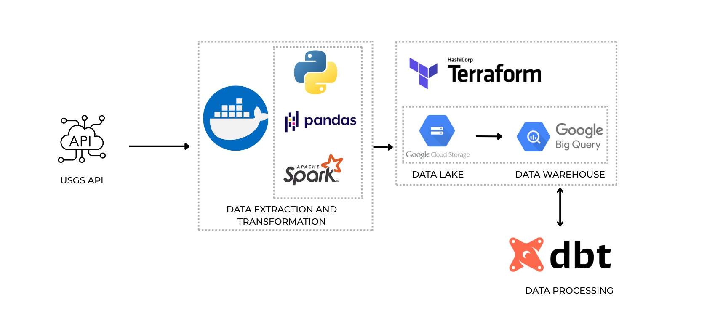
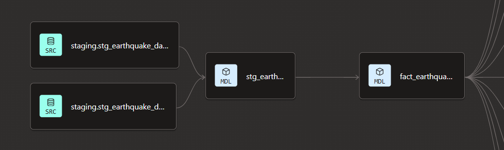

# Earthquake-Data-Pipeline

This is an ETL project that prepares earthquake data from 1500 until present 2025. It extracts data from
 USGS API and cleans it with pandas and apache spark. The data is loaded into GCP and pulled into dbt for data modeling.

 ## Features

 <p align="center">
     
 </p>

 - Extracted earthquake data from 1500 until 2025 from [US Geological Survey](https://earthquake.usgs.gov/fdsnws/event/1/) API
 - Used geopandas to fill country and region data from raw coordinates
 - Used jupyter notebooks and pandas to explore data and find inconsistencies, then cleaned using spark for efficient handling of huge data
 - Orchestration done for batch/monthly data using airflow
 - Containerized extraction using docker
 - Created data infrastructure with terraform and uploaded data into GCP BigQuery
 - Data modeling done using dbt 
<br>

 ### Containerization

Docker was used to containerize the data pipeline. 
```bash
docker-compose build
docker-compose up -d
docker exec -it airflow-dev bash
```
<br>

The container entrypoint is a bash terminal. To generate the data, historical data is generated first then after it is done, airflow orchestration for batch data will follow. The pipeline for batch follows almost the same process for the historical except for the orchestration.
<br><br>

 ### Data Extraction

The extraction script can be found in [extract_historical.py](pipeline/extract_historical.py). The data was extracted from the [USGS API](https://earthquake.usgs.gov/fdsnws/event/1/). <br>Run the script from the container CLI to generate historical-earthquake-data-raw.csv. The output files are found in output/csv_files which are included in .gitignore. 
The output folder also includes logs for success and errors during the execution. 
<br>

```bash
python pipeline/extract_historical.py
```
<br><br>

### Data Transformation

The data transformation was done in two steps and script which are [add_region_chunks.py](pipeline/add_region_chunks.py) and 
[clean_historical.py](pipeline/clean_historical.py) for adding region from raw coordinates and cleaning the raw data, respectively. 
<br><br>

For adding country and region, a [shapefile](pipeline/world-boundaries/ne_10m_admin_0_countries.shp) that contains world countries geometric boundaries is needed for the spatial join to be done with the coordinates in the raw data.
<br><br>

Jupyter notebooks are available where I explored the data first. [world-boundaries.ipynb](data_exploration_notebooks/world-boundaries.ipynb) contains the testing for the shapefile. [earthquake-data-exploration.ipynb](data_exploration_notebooks/earthquake-data-exploration.ipynb) and [earthquake-data-cleaning.ipynb](data_exploration_notebooks/earthquake-data-cleaning.ipynb) are also available where I experimented with exploring the data to decide how I should clean it. 
<br>

```bash
python pipeline/add_region_chunks.py
python pipeline/clean_historical.py --partitions 4
```
<br>

add_region_chunks.py will create historical-earthquake-data-processed-countries.csv in output/csv_files. clean_historical.py will create parquet files in output/parquet_files/historical/ ready for loading into data lake.
<br><br>


### Loading Data into GCP and BigQuery

The infrastructure was created using terraform. The configuration files can be found [here](terraform/). [Install](https://developer.hashicorp.com/terraform/install) terraform first based on your operating system, then edit the configuration files based on your project. 
```bash
terraform init
terraform plan
terraform apply
```
An active GCP account must be present. Google Cloud SDK is also used to upload files into GCS Buckets. The resulting parquet files are uploaded into GCS Buckets using gsutil command. Changed the GCS bucket name for yours in your project. Also, save your project credentials.json in secrets/ as it is used in airflow later.
```bash
gsutil -m cp -r output/parquet_files/historical/*.parquet gs://earthquake_data_buckets/historical
```
<br>

Then, the parquet files are loaded into an external table which is then used to create the staging table for our data in BigQuery.
```bash
CREATE OR REPLACE EXTERNAL TABLE `{{ project }}.earthquake_stg_data.external_earthquake_data_historical`
OPTIONS (
    format='PARQUET',
    uris=['gs://earthquake_data_buckets/historical/*']
);

CREATE OR REPLACE TABLE `{{ project }}.earthquake_stg_data.stg_earthquake_data_historical`
AS SELECT * FROM `{{ project }}.earthquake_stg_data.external_earthquake_data_historical`;

CREATE OR REPLACE TABLE `{{ project }}.earthquake_stg_data.stg_earthquake_data_monthly`
AS SELECT * FROM `{{ project }}.earthquake_stg_data.external_earthquake_data_historical` 
WHERE 1=0;
```

Replace {{ project }} with your project-id. An empty monthly table was also initialized.
<br><br>


### Data Modeling

<p align="center">
     
 </p>

After the data was loaded into the data warehouse, dbt is used to transform and create data models. The staging and fact tables are found in [dbt_files/models/core](dbt_files/models/core/). The staging model standardized naming and data types. In the fact table, a column named 'severity' was created to classify earthquake strength. Event year and decade was also generated which will be used for analytical models. 
<br><br>
The analytical models can be found in [dbt_files/models/analytics/](dbt_files/models/analytics/). Some models that can be found are countries' earthquake stats per decade, yearly earthquake statistics and changes, and most dangerous earthquake recorded based on alert level.
<br><br>


 ### Airflow


